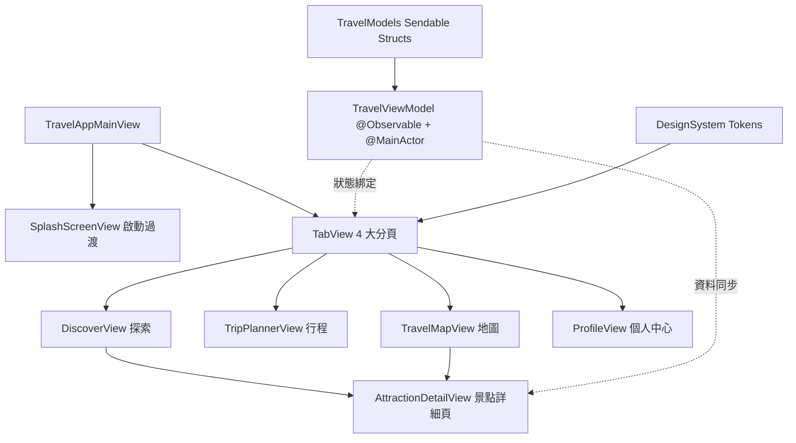

# TravelEase iOS (旅程悠遊) 🏝️

[](https://swift.org)
[](https://developer.apple.com/ios/)
[](Tests/TravelEaseTests)
[](LICENSE)

> **TravelEase (旅程悠遊)** 是一款專為台灣在地旅遊與深度探索量身打造的現代 iOS 智慧觀光應用。結合 **SwiftUI 原生架構**、**iOS 17+ 現代狀態管理 (`@Observable`)**、**Apple HIG 設計系統規範** 與 **單檔高保真 HTML 互動原型**。

---

## 📱 互動原型展示 (Interactive Prototype)

本專案內建單檔高保真 HTML 互動原型，內建 **iPhone 16 Pro** 外觀、動態島 (Dynamic Island) 以及流暢的畫面轉場與即時資料連動：

```text
┌──────────────────────────────────────────────┐
│  09:41              (  九份老街 導航中 📍  )      │ ← Dynamic Island
├──────────────────────────────────────────────┤
│  早安，探索者 🌄                              │
│  探索台灣美景                    [ 🔔 ]        │
│ ┌──────────────────────────────────────────┐ │
│ │ 🔍 搜尋景點、城市、私房秘境...             │ │
│ └──────────────────────────────────────────┘ │
│ [ ✨ 全部 ] [ 🌲 自然山海 ] [ 🏛️ 歷史人文 ]    │ ← Category Pills
│ ┌──────────────────────────────────────────┐ │
│ │ 🌅 本週必訪 Top 1: 九份山城老街           │ │ ← Hero Feature Card
│ │ ⭐ 4.8 · 新北瑞芳                         │ │
│ └──────────────────────────────────────────┘ │
│  熱門探索景點                                │
│ ┌──────────────────────────────────────────┐ │
│ │ 🏞️ 日月潭環湖步道           ⭐ 4.9 [ 🤍 ] │ │
│ │ 🌲 阿里山森林遊樂區         ⭐ 4.9 [ ❤️ ] │ │
│ └──────────────────────────────────────────┘ │
├──────────────────────────────────────────────┤
│   [ 🧭 探索 ]   [ 📅 行程 ]   [ 🗺️ 地圖 ]   [ 👤 我的 ] │ ← Tab Bar
└──────────────────────────────────────────────┘
```

👉 **本機快速體驗**：以瀏覽器直接開啟 [prototype/travel_app_prototype.html](prototype/travel_app_prototype.html)。

---

## ✨ 核心功能模組

| 模組 | 功能描述 | 技術特色 |
|---|---|---|
| 🎬 **啟動畫面 (Splash Screen)** | 深邃星夜漸層、動態環境光球、品牌 Logo 彈性縮放與平滑淡出過渡 | `SplashScreenView` 搭配 `ZIndex` 與 `withAnimation` |
| 🔍 **探索首頁 (Discover)** | 即時關鍵字搜尋、分類標籤切換、精選 Hero 推薦與熱門景點卡片清單 | `LazyVStack`、`ScrollView(.horizontal)` |
| 📅 **行程時間軸 (Trip Planner)** | Day 1 / Day 2 / Day 3 分頁切換、交通耗時計算、景點停留標記與長按勾選 | 節點視覺化時間軸、即時加入行程連動 |
| 🗺️ **周邊地圖 (Travel Map)** | 即時景點地圖釘選標記、底部半透明卡片滑動預覽與導航 | 互動式地圖圖釘、`appCard()` 磨砂立體質感 |
| 👤 **個人中心 (Profile)** | 探索家成就等級（Level 4）、景點足跡統計、電子票券 QR Code 與收藏清單 | 個人化儀表板、收藏狀態即時響應 |
| 🏷️ **景點詳細頁 (Detail Modal)** | 景點高畫質大圖、快速資訊 Chip、智慧語音導覽播放模擬、加入行程與導航操作 | Half-Modal 抽屜式彈窗、浮動底部操作列 |

---

## 🏛️ 架構與設計最佳實踐 (Architecture)

本專案嚴格遵循 **Swift 6 & iOS 17/18+ 官方最佳實踐**：



1. **現代狀態管理 (`@Observable`)**：
   - 採用 iOS 17 官方推薦的 `@Observable` 巨集與 `@MainActor`，完全棄用已過時的 `ObservableObject` / `@Published`。
   - View 內使用 `@State private var viewModel` 維持生命週期，避免 View 重繪時狀態遺失。
2. **型別安全導航 (`NavigationStack`)**：
   - 全面採用 `NavigationStack` 搭配自定義 `Route: Hashable`，視圖關閉使用 `@Environment(\.dismiss)`。
3. **Swift 6 Concurrency & Sendable**：
   - 資料模型 (`Attraction`, `TripDaySchedule`, `TripActivity` 等) 全面遵循 `Sendable` 協議。
   - 非同步資料請求善用 `.task` modifier 自動取消機制，防止記憶體洩漏。
4. **效能優化 (Granular Views)**：
   - 拆分細粒度子視圖（如 `TimelineActivityNode`, `AttractionCardRow`），縮小 SwiftUI Diff 重繪範圍。
   - 嚴禁在 `body` 內執行昂貴的排序計算。

---

## 🎨 設計系統 (Design System Tokens)

採用符合 **Apple Human Interface Guidelines (HIG)** 與 **Glassmorphism 微磨砂質感** 的設計體系：

- **主題色彩 (AppColors)**：
  - `Primary` (蔚藍 `#2563EB`)：品牌信賴主色
  - `Accent` (日落珊瑚橘 `#EA580C`)：高對比行動呼籲 (CTA)
  - `Background` (`#F8FAFC`)：清爽淺灰底色
  - `Card Background` (`#FFFFFF`)：卡片白色底
  - `Success` (`#10B981`) / `StarGold` (`#F59E0B`)
- **間距標準 (AppSpacing)**：`xs: 4pt`, `sm: 8pt`, `md: 16pt`, `lg: 24pt`, `xl: 32pt`, `xxl: 48pt`
- **圓角標準 (AppCornerRadius)**：`sm: 8pt`, `md: 12pt`, `lg: 16pt`, `xl: 24pt`, `full: 999pt`

---

## 📁 專案檔案結構

```text
travel-ease-ios/
├── Package.swift                     # Swift Package Manager 專案配置
├── README.md                         # 專案完整說明文件
├── .gitignore                        # Git 忽略配置
├── Sources/
│   └── TravelEase/
│       ├── DesignSystem/
│       │   └── DesignSystem.swift    # 品牌色彩、字體、間距 Token 與 ViewModifiers
│       ├── Models/
│       │   └── TravelModels.swift    # Attraction, TripDay, Activity 資料結構與 Mock 資料庫
│       ├── ViewModels/
│       │   └── TravelViewModel.swift # @Observable 核心狀態管理與業務邏輯
│       └── Views/
│           ├── TravelAppMainView.swift   # 4 Tab 導覽列與 Toast 根視圖
│           ├── SplashScreenView.swift    # 品牌啟動畫面與光暈動效
│           ├── DiscoverView.swift        # 探索首頁與景點卡片
│           ├── TripPlannerView.swift     # 每日行程時間軸
│           ├── TravelMapView.swift       # 地圖周邊探索
│           ├── ProfileView.swift         # 個人中心與電子票券
│           └── AttractionDetailView.swift# 景點詳細頁 Half Modal
├── Tests/
│   └── TravelEaseTests/
│       └── TravelEaseTests.swift     # Swift Testing 單元測試套件
├── prototype/
│   └── travel_app_prototype.html     # iPhone 16 Pro 單檔高保真 HTML 互動原型
├── design-system/
│   └── ios-design-system/
│       └── MASTER.md                 # UI/UX Pro Max 產出之設計系統 Source of Truth
└── swift-ios-best-practices.md       # Context7 檢索之權威 Swift 開發指南
```

---

## 🚀 快速開始與使用指引

### 1. 執行單元測試 (Swift Testing)
本專案已配置完整的 Swift Testing 測試案例：
```bash
swift test
```
輸出範例：
```text
✔ Test "驗證景點依分類篩選功能" passed after 0.001 seconds.
✔ Test "驗證關鍵字搜尋功能" passed after 0.001 seconds.
✔ Test "驗證收藏狀態切換" passed after 0.001 seconds.
✔ Test "驗證將景點加入行程時間軸" passed after 0.001 seconds.
✔ Suite "TravelEase Core State & Logic Tests" passed (4/4 tests passed).
```

### 2. 開啟 HTML 互動原型
在任何瀏覽器中直接開啟 HTML 原型體驗完整互動：
```bash
# Linux / WSL2
explorer.exe prototype/travel_app_prototype.html

# macOS
open prototype/travel_app_prototype.html
```

### 3. 在 Mac / Xcode 啟動原生 iOS 模擬器
1. 將本儲存庫 Clone 至 macOS 環境：
   ```bash
   git clone https://github.com/yaochangyu/travel-ease-ios.git
   ```
2. 使用 Xcode 開啟專案根目錄中的 `Package.swift`。
3. 於 Xcode 頂部選擇目標模擬器（例如 `iPhone 16 Pro`），按下 `Cmd + R` 即可原生啟動編譯與執行。

---

## 📜 授權條款 (License)

本專案採用 [MIT License](LICENSE) 開源授權。
